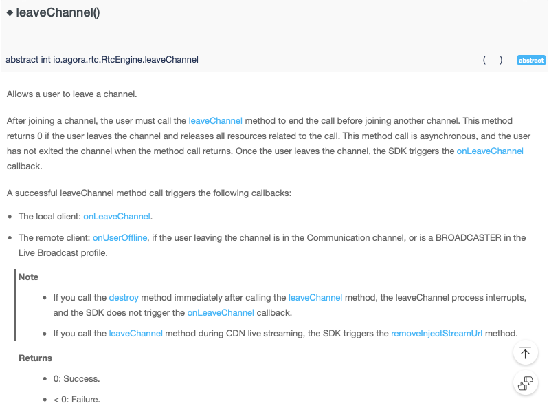

## API Reference code comments

When you are documenting an API, provide a complete API reference, which is typically generated from source code using doc comments that describe all public classes, methods, constants, and other members.

The API reference **must** provide a description for each of the following:

- Every class, interface, struct, and any other similar member of the API (such as union types in C++).
- Every constant, field, enum, typedef, and so on.
- Every method, with a description for each parameter, the return value, and any exceptions thrown.

The following are **extremely strong suggestions**. In some cases, they may not make sense for a particular API or in a specific language, but in general, follow these guidelines:

- Put **all** API names, classes, methods, constants, etc. in code font, and link each name to the corresponding reference page. Most document generators do this automatically for you. If you need to mention the same API several times in the description for one method or callback, only link to the API at the first mention.
- Put string literals in code font, and enclose them in double quotation marks. For example, XML attribute values might be `"wrap_content"` or `"true"`.
- Make sure that the spelling of a class name in documentation matches the spelling in code, with capital letters and no spaces (for example, `ActionBar`).
- Check for typos in the code and raise them to development to get fixed.

:::{admonition} Example

:::

### Classes, interfaces, structs

In the first sentence of a class description, briefly state the intended purpose or function of the class or interface with information that cannot be deduced from the class name and signature. In additional documentation, elaborate on how to use the API, including how to invoke or instantiate it, what some of the key features are, and any best practices or pitfalls.

Many doc tools automatically extract the first sentence of each class description for use in a list of all classes, so make the first sentence unique and descriptive, yet short. Additionally:

- Do not repeat the class name in the first sentence.
- Do not say "this class will/does ...." in the first sentence.
- Do not use a period before the actual end of the description (keep the description in one sentence), because some doc generators naively terminate the "short description" at the first period. For example, some generators terminate the sentence if they see "e.g.", so use "for example" instead.

### Enumerates

Make descriptions for enumerates as brief as possible. Be sure to link to relevant methods that use the enumerate.

### Methods/Callbacks

In the first sentence for a method/callback description, briefly state what action the method/callback performs.

In subsequent sentences, explain why and how to use the method/callback, state any prerequisites that must be met before calling/triggering it, give details about exceptions that may occur, and specify any related APIs. For a method, describe which callback it triggers. For a callback, describe which method triggers it.

Use present tense for all descriptions.

#### Description

- If a method performs an operation and returns some data, start the description with a verb describing the operation.

- If it is a "getter" method and it returns a Boolean, start with "Checks whether ...."

- If it is a "getter" method and it returns something other than a Boolean, start with "Gets the ...."

- If it has no return value, start with a verb like one of the following:

  - Turning on an ability or setting: "Sets the..."
  - Updating a property: "Updates the..."
  - Deleting something: "Deletes the..."
  - Registering a callback or other element for later reference: "Registers..."

- If it is a convenience method that constructs the class object, start with "Creates a..."

- If a callback occurs when a method triggers it, start with "Occurs when..."

- If a callback reports an error or statistics, start with "Reports..."

#### Parameters

For parameter descriptions, follow these guidelines:

- Capitalize the first word, and end the sentence or phrase with a period.
- Begin descriptions of non-Boolean parameters with "The" or "A" if possible.
- For Boolean parameters use a list that includes "true" and "false", followed by corresponding functions. Do not put the words "true" and "false" in code font or quotation marks. Notice the capitalization difference across different platforms.
- For Optional or Default parameters, put (Optional) or (Default) as the first word of the description.

#### Return values

Be as brief as possible in the return value's description; put any detailed information in the class description.

- If the return value is anything other than a Boolean, start with "The..."
- If the return value is a Boolean, describe the Boolean and use a list that includes "true" and "false", followed by corresponding indications.

#### Exceptions

In languages where the reference generator automatically inserts the word "Throws", begin your description with "If..." Otherwise, begin with "Thrown when..."

#### Deprecations

When something is deprecated, tell the user what to use as a replacement.

If you track your API with version numbers, mention which version it was first deprecated in.

Only the first sentence of a description appears in the summary section and index, so put the most important information there. Subsequent sentences can explain why it was deprecated, along with any other information that is useful for a developer using your API.

### Inline code comments

Inline code comments are comments not included in API header files, and usually appear in the sample code.

- Comments should be one line above the code they refer to and start with "// ".
- Comments should use the same indenting as the succeeding code.
- Only use periods for complete sentences.
